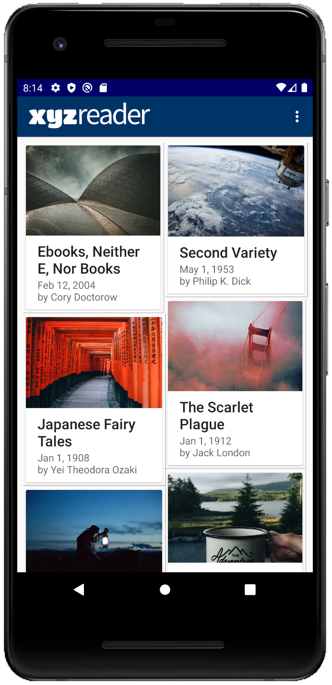
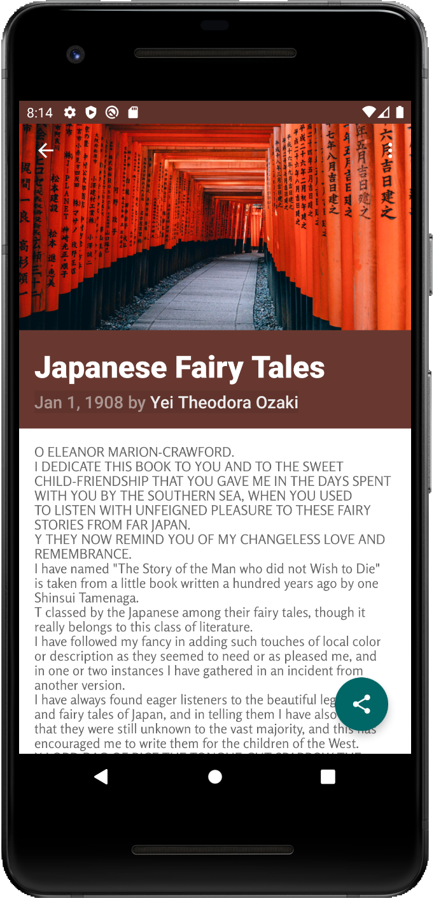
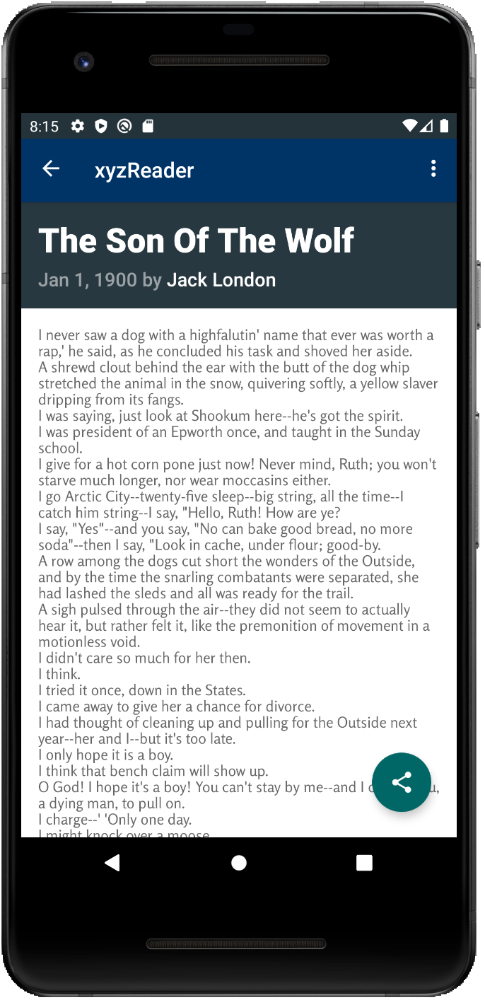

# Udacity - MakeAppMaterial

# XYZ Reader 

## Project Overview
In this project, you will redesign an app to follow the Material Design guidelines and translate a set of static design mocks to a living and breathing app.

## Why this Project?
This project gives you an opportunity to improve an app’s design, a vital skill for building apps users will love. It also replicates a common developer task of updating and changing an app's design as new standards are released.

## What Will I Learn?
Through this project, you will:

* Understand the fundamentals of Android design.
* Apply Material Design guidelines to an mobile application.
* Separate an interface into surfaces.
* Effectively use transitions and motion.

## Image Resources
[Reading](https://www.flaticon.com/free-icon/reading_86541)
made by [Freepik](http://www.freepik.com) from [www.flaticon.com](www.flaticon.com) is licensed by
[CC 3.0 BY](http://creativecommons.org/licenses/by/3.0/).

## Video
I've created a video demonstrating the app. Click [here](https://youtu.be/EQR6c5XaQIA) to view the video.

## Features
* Implement the Shared Element Transition
* Customize the animation using PageTransformer
* Show a Snackbar with a button that allows to perform an action
* Use CoordinatorLayout, CollapsingToolbarLayout
* Create a custom ThreeTwoImageView to make all the images have the same proportion

   
 
## Join development!

**Build status:** master  stable 

**Start contributing:** Make sure you read [SETUP.md](https://github.com/owncloud/android/blob/master/SETUP.md) when you start working on this project. Basically: Fork this repository and contribute back using pull requests to the master branch.

**License:** [GPLv2](https://github.com/josefdeutsch/udacityappmaterial/blob/master/LICENSE.txt)
